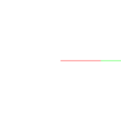

# Task00: GitHub & Rust introduction

**Deadline: Apr. 24th (Thu) at 15:00pm**



----

**The class only introduce some basics of Rust and GitHub. If you have any questions, or if you encounter any problem, ask chat-based AI (e.g., ChatGPT, DeepSeek) first.**

### Environment Set Up

Please install Git in your computer (if you do not have)

https://git-scm.com/book/en/v2/Getting-Started-Installing-Git

Check if the Git is installed by

```bash
$ git --version
```

Then install Rust in your computer
https://www.rust-lang.org/tools/install

Make sure the Rust is installed on your computer by typing in the terminal as:

```bash
$ cargo --version
```

### Local Repository Preparation

if you don't have the local repository (repository on your computer), clone it from the remote repository (repository on the GitHub).

```bash
$ git clone https://github.com/PBA-2025/acg-<username>.git
```

Go to the top of the local repository, then make sure you are in the `main` branch

```bash
$ cd acg-<username>  # go to the local repository
$ git checkout main  # set main branch as the current branch
```

### Branch Creation

To do this assignement, you need to be in the branch ``task00`. You can always check your the current branch by

```bash
$ git branch -a   # list all branches, showing the current branch 
```
You are probably in the main branch. Let's create the `task00` branch and set it as the current branch.

```bash
$ git branch task00   # create task0 branch
$ git checkout task00  # switch into the task01 branch
$ git branch -a   # make sure you are in the task01 branch
```


## Problem 0

run the code with command

`cargo run --release`

This command build and run the code and put a gif animation below


## Problem 1

Write a simple code around line `#56` in the `src/main.rs`.  

First, define `p2: [f32;2]`. `p2` is rotating around the `p1` twice the speed of `p1` rotating around `p0`. The distance between `p1` and `p2` is `50px`. Then draw another line from `p1` to `p2` in green. Furthermore, draw the trajectory of `p2` in blue.


Run the program and a gif image `problem1.gif` will be generated and shown below.


## Pull Request Submission

Finally, you submit the document by pushing to the task01 branch of the remote repository.

```bash
$ cd pba-<username>    # go to the top of the repository
$ git status  # check the changes (this will hilight main.cpp and output.png)
$ git add .   # stage the changes
$ git status  # check the staged changes
$ git commit -m "task00 finished"   # the comment can be anything
$ git push --set-upstream origin task00  # up date the task01 branch of the remote repository

```
got to the GitHub webpage `https://github.com/PBA-2025/pba-<username>`. If everything looks good on this page, make a pull request.


## Reference


- This is the algorithm to draw a line: https://en.wikipedia.org/wiki/Digital_differential_analyzer_(graphics_algorithm)
- This is how the GIF iamge works: https://en.wikipedia.org/wiki/GIF

